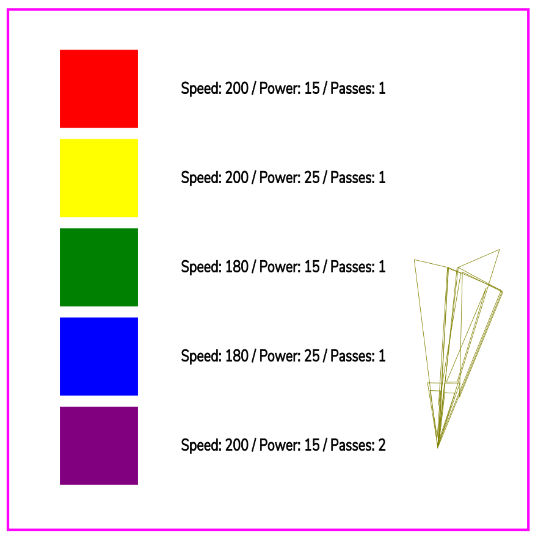

- [Engraving (flat) glass](#engraving-flat-glass)
- [The template](#the-template)
- [The Engraving](#the-engraving)

# Engraving (flat) glass

These are my results from doing some testing on a bit of 4mm thick, cast glass measuring 100mm x 100mm.

I've included my [testing SVG file](images/HPC-lasercutter/glass-engraving/coaster-template.svg) if want to see it or use it.

During the test I added 2 additional boxes to the test coaster not covered in the template above but I'll explain the settings further on.

# The template

The colours are, as you'd expect, for LaserCut so I could set the various speed and power settings. I did each colour one by one so I could check and observe the operation. I also adjusted the black colour so it would be engraved with the same power and speed settings for each of the colours.

The line art image is suppose to be a paper airplane, this was put on the glass using a `cut` rather then using `engrave` setting. 

# The Engraving

