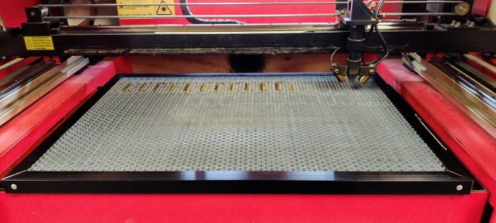
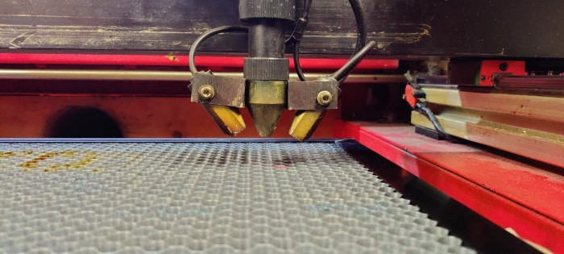
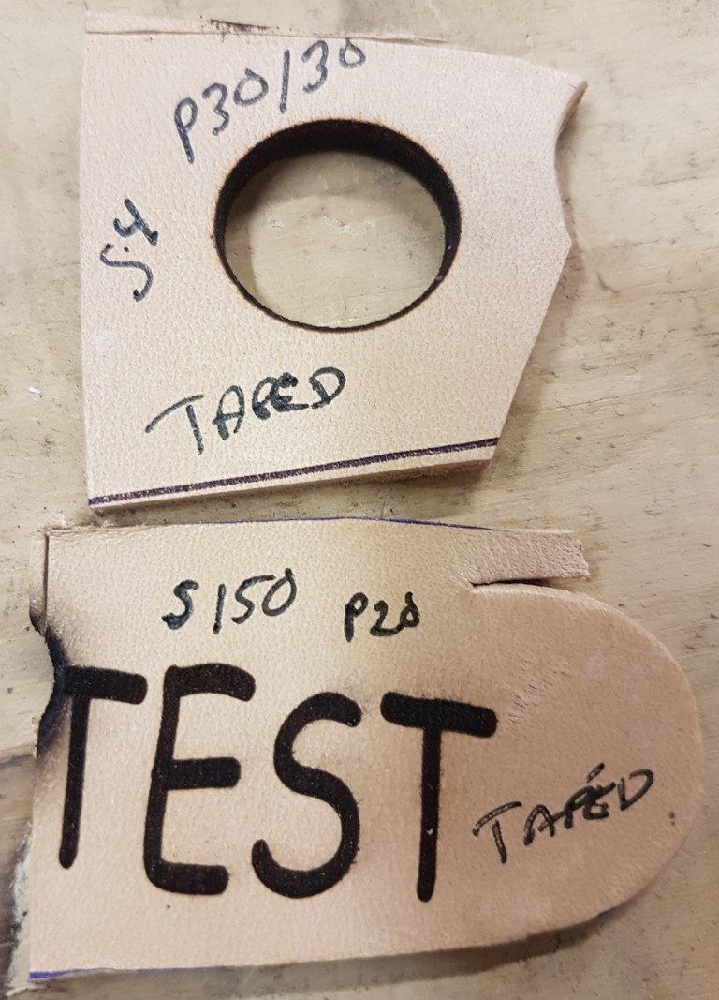
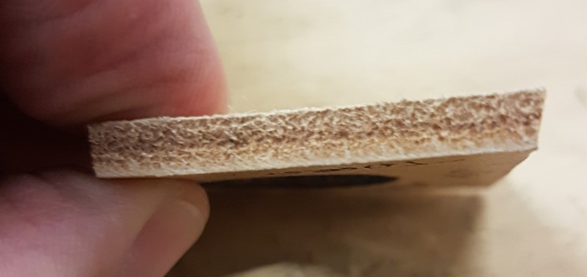
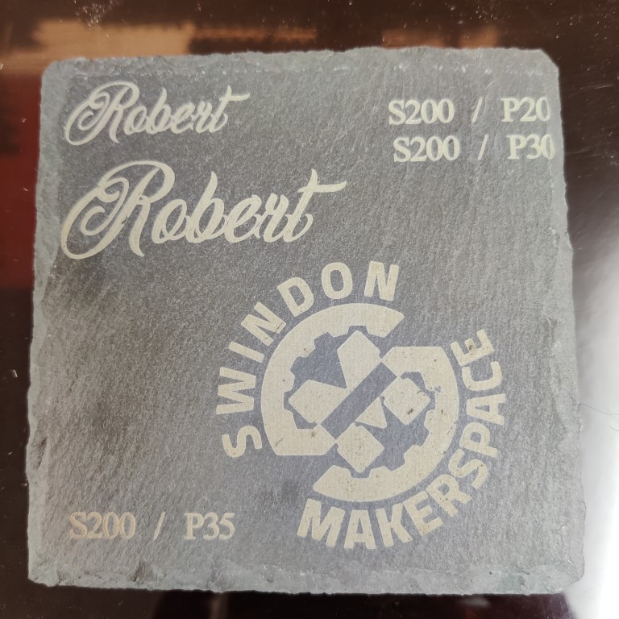
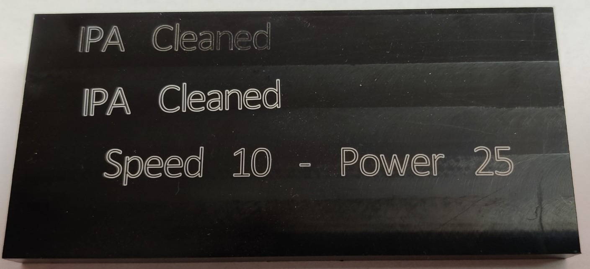

The [HPC LS6840](https://hpclaser.co.uk/co2-laser-cutters/ls6840/) laser cutter (60w) and [CW5200 Chiller](https://hpclaser.co.uk/p/cw5200-water-chiller/) ([Manual](documents/CW5200_Manual.pdf)) was obtained by free loan agreement from [Reprap LTD](https://reprapltd.com/) in October 2016. A condition of this loan agreement is that a notice of the free loan will be displayed on the laser at all times, therefore this notice MUST NOT be removed.

The software used to send cutting jobs to the laser is called [LaserCut](https://www.ctrlasers.co.uk/userfiles/downloads/user_manual_operator_93482.pdf) and is installed on the laptop next to the laser.

Bed working area: **680 x 400mm**

- [Designing for the Laser](#designing-for-the-laser)
- [Font selection:](#font-selection)
- [Using the cutter:](#using-the-cutter)
    - [LaserCut Software](#lasercut-software)
    - [Laser Cutter Hardware](#laser-cutter-hardware)
    - [Adjusting the Focus (cutting bed height)](#adjusting-the-focus-cutting-bed-height)
- [What you can and can not cut](#what-you-can-and-can-not-cut)
- [Changing the water](#changing-the-water)
- [Settings](#settings)
  - [Cut Settings](#cut-settings)
  - [Engrave Settings](#engrave-settings)
- [Alternate Cutting Bed](#alternate-cutting-bed)
- [Various Test Cuts](#various-test-cuts)
  - [Leather Tests](#leather-tests)
  - [Slate Tests](#slate-tests)
  - [Anodised Aluminium Tests](#anodised-aluminium-tests)
- [Useful Links](#useful-links)
    - [Known good config file](#known-good-config-file)
    - [Useful tools](#useful-tools)
    - [Box Designers](#box-designers)
    - [Templates](#templates)
    - [Fonts](#fonts)
- [Details](#details)
- [Troubleshooting](#troubleshooting)

---

# Designing for the Laser

The best format for the LaserCut 5.3 software to import is a .dxf file (R14, if multiple options are available). This can be generated using many different design programs, but the recommended option is Inkscape (available for free download from https://inkscape.org/en/).

Specific tips / processes can be found on this page: [Designing for the Laser Cutter](Designing-for-the-Laser-Cutter.md)

# Font selection:

There is a wide selection of fonts already installed on the laser cutter laptop. Should you want to add more feel free to download more. An excellent source of fonts is [dafont.com](https://dafont.com). Download and extract the `zip` file, select `ttf` file, right click and select `install for all users`. You may have to restart the application you want to use the new font.

In order to use the script font correctly, use CAMBAM. installed on the laser laptop.

1. Open CAMBAM. 
2. With the window open, displaying the black screen with green cross, click the `T` in the menu bar at the top.  This opens the TEXT input. Select the font you wish to use and size 36 - this is adjusted later. 
3. Type the words you want to use.
4. Click OK. You will then be prompted to locate the text in the design. Useful if using the drawing tools to design a shape.
5. Click where you want to put the text. 
6. When using SCRIPT text, you will need to unite all letters to form a single continual line. Do this by HIGHLIGHTING ALL THE TEXT and press Control + U to unite all the lines. Do this when using PACIFICO. 

When completing your design go to **File-> Export-> DXF**. 
Save the file in a useful location, and then open Lasercut5.x and import your dxf file. 
Use the scale tool to get the text to the correct size you want.

# Using the cutter:

You will need your drawings in dxf format, and some way to transfer them to the computer by the cutter. USB flash drives are preferred for ease of use, but you can use dropbox or similar - remember to use private browsing so that your details aren't saved when you're finished.

### LaserCut Software
Next, open the laser cutter software, which is named, imaginatively, "laser cut".  It's pinned to the taskbar and also on the desktop.

* Import your dxf file -- File Menu -> Import.

* Simplify the lines to cut -- Tools Menu -> Unify lines. 

   This joins up lines that touch or almost touch, and allows the software to select a (relatively) efficient path forthe laser to travel in. If you have issues with engraving text, make sure you're running this step.

* Create layers if needed

    Layers define the laser settings. If you wish to engrave some parts and cut others, or to perform partial cuts, you will need to set layers for your different operations. This is accomplished by using the mouse to pick (or ctrl-click or click + drag) all the lines or parts for the new layer, then click on a colour in this list at the bottom of the screen. Repeat to add more to the same layer, or create a third one, etc.

* Specify how layers are treated.

    In the top-right corner of the program, there is a list with some colour swatches in, which match the colours of the layers in your drawing. The laser will cut each layer in the order shown in the list, top to bottom - this can be changed by dragging and dropping the layers. For example, you should perform engraving and minor cuts before big cuts which will leave loose pieces. Each colour also has its own settings associated with them -- type, speed, and power. These should be set to match the material being worked on - the materials list below will give starting points, but note that similar looking materials can require different settings anyway -- for example, different densities of foam board, even if they are the same thickness, or wood with or without knots in it. Power ranges from 10% (the laser will not fire below 10%) and 100%. **Generally it's helpful to perform some test operations before committing to a job to ensure that your settings are correct.**

Speed is measured in mm/s. There are two speeds listed -- "speed" and "corner speed". "Speed" is how fast it moves on straight lines, and "corner speed" is how fast it moves when going around corners, which should generally be about 5mm/s slower. 

* Arrange parts

    If you're cutting a bunch of parts, and your dxf has them scattered all over the place, drag & drop them until you have them arranged as close as possible in a vaguely rectangular shape. This saves on material.

    If engraving text, ensure the text is arranged with the longest dimension left/right. This speeds up engraving as the laser has to make fewer passes (it engraves left and right, back and forth).

### Laser Cutter Hardware
* Check the equipment

    Go around to the chiller, carefully remove the fill cap and look inside, can you see the water? Good. It's a good idea to do a smell test on the water from time to time, it should smell like clean water, if it has an oder please tell someone on Telegram so it can be investigated and flushed.  **DO NOT** put bleach or anything else into the water tank as this will damage the inner workings and lead to malfunction.
    
* Turn on

    Flip the key-switch on the side of the laser cutter to turn it on.  This will turn on the compressor, the extractor fan on the roof, the chiller, and provide power to the fancy stainless steel extractor/filter unit.  (Which won't turn on quite yet.)  If any of that stuff doesn't turn on, something is wrong, and you shouldn't cut until everything is working properly.

**Note: If cutting in hot weather, make sure the chiller's temperature drops to with in 2-3C of the target temperature before starting work. The target temperature is the bottom figure (currently 18C), the current temperature the top figure. It may take five minutes to chill sufficiently if ambient temperature in the space is over 25C.**

* Send data to laser

    Once the laser is on, you can send over your instructions by hitting the "Download" button, on the far right of the `lasercut` software, then "Download Current". Once this is done counting, all the work is on the laser (unless you need to rejig something..). To ensure your items are cut starting at the top-right of the laser bed, make sure the `immediate` (sometimes shows as `relative`) checkbox near the button is checked. If it wasn't, do it and Download again.

* Align laser material in the laser

    Open the lid of the laser and put in your material, if the laser head isn't currently top-right, hit the "Datum" button on the laser to move it there. Align your material so that the top-right corner is under the laser head (red light!)

### Adjusting the Focus (cutting bed height)

* Make sure the laser is focused, this also includes raising or lowering the cutting bed (Z axis)

   
On the bench next to the laser should be some MDF focus assist tools shaped like the one in the above photo Take one, and hit ESC on the laser controls, remove your hands and other appendages from the work area, then press "Test" - this will move the laser head around the extreme edges of your workpiece. Hold the tool to the workpiece and laser head as pictured. The laser head is in the correct position (calibrated for 3mm material) if the tool fits neatly between the head and workpiece. 

If the bed is too high or low, hit the Z button in the middle of the control pad, and then Up or Down to adjust - this *should* move in tiny increments.. if it doesn't - then someone needs to insert instructions here on how to change the increments.

If the laser is focused in some places and not others, tape down or weigh down your material with something.. keep hitting "Test" to check, and also make sure your weights are outside of the cutting area!

**Note: If cutting transparent or translucent acrylic, focus the laser *before* removing the plastic film**

* Turn on the extraction system

    On the wall socket behind the Laser Cutter, switch on the second socket, this is for the blue extraction fan unit. If it's noisy, it's working! 
    
    ⚠️ If this fails to turn on stop and investigate or ask on Telegram. Without the extraction system the Laser Cutter should not be used no matter how small the job. ⚠️ 

* Cut!

    Close the laser lid, and press the "Start/Pause" button

# What you can and can not cut

To see what you can and can not cut go here [NEVER CUT THESE MATERIALS](documents/NEVER-CUT-THESE-MATERIALS.pdf)

[http://atxhackerspace.org/wiki/Laser_Cutter_Materials#NEVER_CUT_THESE_MATERIALS](http://atxhackerspace.org/wiki/Laser_Cutter_Materials#NEVER_CUT_THESE_MATERIALS)

# Changing the water

* If the water needs to be changed, take an empty bucket, and around four to six litres of clean tap water. **WARNING** Chiller contains around 6L of water!
* Turn off the laser cutter and chiller, and pull the chiller forwards slightly for easier access. 
* Around the back of the chiller, position your bucket behind the water pipe fittings and remove the "outlet" pipe carefully. It will likely drip into the bucket.
* Remove the lid of the chiller, and the lid of your water container (if applicable).
* Turn on the laser cutter with the key, and the chiller will start pumping water into the bucket. Note: It will beep angrily, this is how it warns of a leak. Ignore it, because you should be catching the leak in your bucket. 
* Pour your water into the chiller to keep the level roughly constant. It will pump through the chiller, through the laser and into the bucket, hopefully flushing out any contaminants.
* Once you approach the bottom of your water container, switch off the laser cutter. The chiller should switch off. Re-attach the outlet pipe.
* Turn on the laser cutter again. Keep an eye on the water level, and top up if required - the water should just cover the pipework coils inside the tank.
* Put in an inner capful (~15ml) of the sterilising fluid kept by the chiller, and leave the chiller on for two minutes to allow the sterilised water to be circulated.
* Re-fit the lid and turn off the chiller. Carefully slide it back into position.

# Settings

## Cut Settings
| Material | Speed (mm/s) | Power (%) | Corner Power | Passes | Note |
| -------- | ------------ | --------- | ------------ | ------ | ---- |
| Acrylic, 3mm, Clear | 10 | 65 | | 1 | |
| Acrylic, 3mm, Colour | 20 | 65 | | 1 | |
| Acrylic, 4mm, Clear | 8 | 65 | | 1 | |
| Acrylic, 6mm, Clear | 4 | 65 | | 1 | |
| Balsa | 250 | 14 | 12 | 1 | Mark surface |
| Balsa, 1.6mm (1/16th) | 110 | 24 | 24 | 1 | Cut |
| Balsa, 3mm | 40 | 50 | 50 | 1 | Cut |
| [Bamboo](https://kitronik.co.uk/collections/bamboo-sheets/products/32103-5mm-bamboo-plain-pressed-natural-600mm-x-400mm-sheet), 5mm | 10 | 40 | | 4 | 4-6 Passes at these settings were needed, more power and it chars too much |
| Black mesh | 200 | 16 | | 1-2 | | 
| Card, 250gsm | 320 | 17 | | 1 | |
| Cardboard, Single Wall, 4mm | 50 | 30 | | 1 | |
| [Cork](https://kitronik.co.uk/collections/materials/products/3287-3mm-laser-cork-600mm-x-400mm-sheet), 3mm | 60 | 35 | | 1 | Faster speed is ideal to cut down risk of burning |
| Felt, 8mm, 100% wool, dense | 7 | 65 | 70 | 1 | full cut |
| Fleece, support material only | 250 | 14 | | 1-2 | Test first, fluffy side down |
| Flite test waterproof Foamboard | 120 | 44 | 36 | 1 | Full cut |
| Flite test waterproof Foamboard | 160 | 26 | 24 | 1 | 1/2 cut |
| Flite test waterproof Foamboard | 250 | 16 | 14 | 1 | Mark surface |
| Foamboard, 5mm | 100 | 42 | | 1 | To cut all the way through |
| Foamboard, 5mm | 130 | 28 | | 1 | To cut half way through | 
| Foamboard, 5mm | 250 | 18 | | 1 | To score |
| Leather, 4mm | 4 | 30 | | 1 | MUST BE REAL LEATHER! Cover with masking tape to reduce burning |
| Plywood - Birch, 3mm | 15 | 50 | | 1 | |
| Plywood, 1.5mm | 20 | 28 | | 1 | |
| Plywood, 3mm | 20 | 50 | | 1 | |
| Plywood, 6mm | 8 | 75 | | 1 | |
| Polypropylene, 1mm | 15 | 30 | | 1 | |
| Red cotton | 200 | 30 | | 1 | | 
| Rubbery material | <250 | 45 | | 1 | |
| Thin fleece, support material only | 180 | 14 | | 1 | Test first, fluffy side down |

## Engrave Settings
| Material | Speed (mm/s) | Power (%) | Passes | Note |
| -------- | ------------ | --------- | ------ | ---- |
| Acrylic, 3mm | 200 | 15 | 1 | |
| Acrylic, 4mm | 160 | 60 | 1 | Gives a nice depth, less power and more passes might be required depending on desired depth |
| Anodised Aluminium (black) | 10 | 25 | 1 | See [pics](#anodised-aluminium-tests) - In Laser Cut select `cut` for this |
| Black mesh | 250 | 13 | 1 | |
| Card 250gsm | 400 | 14 | 1 | |
| Cardboard, Single Wall, 4mm | 250 | 15 | 1 | |
| Fleece, support material only | 300 | 13 | 1 | Test first, fluffy side down |
| Leather, 4mm | 150 | 20 | 1 | MUST BE REAL LEATHER! Cover with masking tape to reduce burning [pics](#leather-tests)|
| Plywood 3mm | 200 | 20 | 1 | | 
| Red cotton | 250 | 18 | 1 | |
| Rubbery material | 250 | 15 | 1 | |
| Slate (coasters) | 200 | 25/30/35 | 1 | These 2 power settings seemed to work well each with a different level of engraving [pic](#slate-tests)|

----

# Alternate Cutting Bed

⚠️ READ THIS BEFORE PROCEEDING ⚠️

Beside the laser cutter you should find a `honeycomb` cutting bed. This cutting bed doesn't replace the exisiting cutting bed it should be placed on top of the existing one. This bed is especailly good when you want to cut smaller objects and would rather not have them fall through the bed. It's also good if you want to be able to cut and engrave on both sides (engrave, cut then flip the parts in the holes and engrave again)

🚨 Before placing the honeycome bed follow these steps 🚨

Make sure you lower the main cutting bed. 

1. Turn on the laser cutter
2. Press the `ESC` button followed by the `Datum` button to ensure the head is homed
4. Press the `ESC` button followed by the `Z` button, press the down arrow button until the bed drops by 3 or 4 cm.
5. Place the honeycomb bed on top of the main bed but be careful not to hit the cutting head.
6. Proceed to adjust the bed now as you normally would.

----

Honeycomb bed was purchased from [Smoke&Mirrors](https://smokeandmirrors.store/products/600mm-x-400mm-honeycomb-bed).

----

# Various Test Cuts

## Leather Tests

## Slate Tests

The coaster used was from [amazon](https://www.amazon.co.uk/gp/product/B0944139N3/ref=ppx_yo_dt_b_asin_title_o01_s00)

## Anodised Aluminium Tests

----

Website of useful settings for different materials (you will need to test and trial some settings first to be sure) [Bosslaser Laser Settings](https://www.bosslaser.com/laser-settings) - if details from here are tested and proven to be useful, please add to the table above.

# Useful Links

### Known good config file

* [Config file](https://github.com/swindonmakers/laser-config) - a known good config file to fix config issues.

### Useful tools

* [Deep Nest](https://deepnest.io/) - This tool will allow you to compact all parts you plan to cut to minimize material waste and optimize cutting paths.

* [SVG Nest](https://svgnest.com/) - Similar program to **Deep Nest**

* [CDR to SVG Conversion](https://cloudconvert.com/cdr-to-svg) - Online conversion from Corel Draw to SVG

### Box Designers

* [BOXES.py](https://www.festi.info/boxes.py/)

* [MakeABox.io](https://makeabox.io/)

* [MakerCase](https://en.makercase.com/#/)

* [Big list of box making programs](https://wiki.umiacs.umd.edu/sandbox/index.php/Laser_Box_Generator_Programs)

* [Box Designer](http://boxdesigner.frag-den-spatz.de/) Starts in German, there is an English button - Lots of options on this one. **THIS ONE IS PAY** 

### Templates 

* [LED Light box templates](https://www.fluid3dworkshop.co.uk/resources/templates) - LED acrylic edge lit signs.

### Fonts

If you want to install fonts, `download` (and unzip if needed), `right click` on the font file (either TTF or OTF) and select `Install for all`. If this isn't done and you just double click on font to install through the GUI, not all apps can use that font.

* [dafont.com](https://dafont.com) - Massive selection of free fonts

# Details
For details on the actual equipment, see the [HPC Laser Cutter Internals](HPC-Laser-Cutter-Internals.md) page

# Troubleshooting

* Chiller error `E05`

> The chiller unit monitors the flow rate of water and it will emit a warning sound and display the error message E05 if the flow rate is too low, this could be caused by kinks in the water tubing or blockages in the piping, if the error message is displayed checked all the water pipes for kinks or tight turns and check the water quality, if the water is murky it should be replaced.

* Machine doesn't engrave

> Sometimes there are issues with the config file changing/becoming corrupted. If this happens, the fix is to replace with a known good version, [here](https://github.com/swindonmakers/laser-config).

