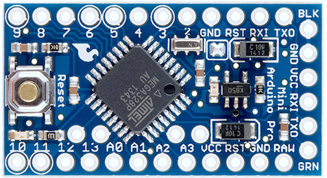
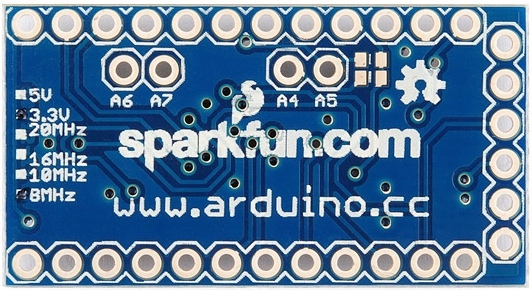

## Overview

LogoBot is a simple, extensible, Arduino-based mobile robot developed by the Swindon Hackspace.  It is heavily inspired by the vast number of existing mobile robots designs (Mirobot in particular).  The development of the reference design has been kicked-off through the OpenSCAD Course and will be an ongoing collaborative project for all members of the Hackspace to participate in.  

See the [Assembly Guides](http://swindon.hackspace.org.uk/LogoBot/hardware/docs/index.htm) for detailed instructions on how to build a LogoBot.

Latest WIP model:

## Principles / Requirements

* Help teach electronics, programming, 3D design and 3D printing (both to ourselves and others)
* Highly interactive - to attract/hold attention
* Cheap (Total BOM <£20 would be great)
* Suitable for ages 6 - 100
* Simplicity is key - all parts/functionality must be easy to explain and understandable by 6-yr olds
* Solderless (where practical)
* Extensible - more sensors, more functionality
* Personalisable - we don't want lots of bland, generic little robots

## BOM

Outline BOM:

Qty | Item | Line Total | Source | Got Some?
--- | ---- | ---------- | ------ | --------
1 | Arduino Pro Mini with FTDI breakout and USB cable | 3.00 | [AliExpress](http://www.aliexpress.com/item/CP2102-Module-Pro-Mini-Module-Atmega328-3-3V-8M-For-Arduinoi-Compatible-With-Nano-Free-Shipping/2002847394.html) | Two
1 | 170 Point Breadboard | 0.60 | [ebay](http://www.ebay.co.uk/itm/271565366887?_trksid=p2059210.m2749.l2649&ssPageName=STRK%3AMEBIDX%3AIT) | On Order
2 | 5V Geared Stepper motors (28BYJ-48) with associated drivers (ULN2003). | 3.52 | [AliExpress](http://www.aliexpress.com/item/5V-Stepper-Motor-28BYJ-48-With-Drive-Test-Module-Board-ULN2003-5-Line-4-Phase-free/1436201179.html) | Yes
4 | lever microswitch | 0.53 | [ebay](http://www.ebay.co.uk/itm/121382500067?_trksid=p2059210.m2749.l2649&ssPageName=STRK%3AMEBIDX%3AIT) | On Order
1 | RGB LED (discrete, not serial!) | 0.07 | [ebay](http://www.ebay.co.uk/itm/301205844253?_trksid=p2059210.m2749.l2649&var=600263731447&ssPageName=STRK%3AMEBIDX%3AIT) | On Order
1 | Piezo sounder | ? | ?
1 | power switch (slider) | 0.06 | [AliExpress](http://www.aliexpress.com/item/100-Pieces-3-Pin-2-Position-1P2T-SPDT-Panel-Mini-Vertical-Slide-Switch-Solder-Lug-SS12F15VG5/1966040655.html) | One
1 | 2x2 AA Battery Pack | 0.49 | [AliExpress](http://www.aliexpress.com/item/Black-Color-2-2-AA-Battery-1-5V-Holder-Storage-Boxes-for-DIY-Experiment-Test-Cascade/1981330624.html) | On Order
4 | AA batteries | ? | ?
- | Miscellaneous consumables (jumpers, fasteners) | ? | ?
- | A bunch of printed parts (base, shell, wheels, bumpers, etc) | ? | ?
  |  | 8.27+ |  | 

NB: If you use ULN2803 you can drive two steppers from a single chip - [aliexpress link to 2 steppers and a driver board](http://www.aliexpress.com/item/New-2-Stepper-Motor-28BYJ-48-With-Drive-Test-Module-Board-ULN2803-Freeshipping/1405946480.html)

## Design

Having discussed a variety configurations, we've settled on the following starter design:

* 2-wheels (stepper driven) with caster(s) - arranged as per traditional Turtle bot
* Front and rear bumpers, each connected to a pair of microswitches - users can choose to remap these switches to control behaviours and/or use them as bump switches
* An RGD LED to give the robot character, located near the top/centre of the robot
* A piezo sounder for audio feedback (R2D2 style noises?)

### Scribbler

The first standard extension will include a pen lift and WIFI UART, integrating with a Mirobot-style host application:

* Central pen with micro-servo lift
* WIFI UART - for cable-free programming, inter-bot comms, host interface, etc

### Other Extensions / Optional Extras
* Bluetooth UART - for cable-free programming, inter-bot comms, host interface, etc
* Serial RGB LED (to reduce pin count)
* IR Reflectance sensors - for collision avoidance, cliff detection, line following, following behaviour, etc
* IR transceiver - for interaction with TV remotes and/or other robots
* Ultrasonic distance sensors - for collision avoidance, following behaviour, etc
* Speaker - for complex audio playback (e.g. WAV, MP3)
* Microphone(s) - for sound following/localisation and/or voice recognition/recording
* Light Sensors (LDR,etc) - following behaviour, etc
* Tilt sensor - for "I've fallen over" behaviour, etc

### Customised Shell Ideas

Although the reference design will include a basic dome shell, we really want makers to customise their LogoBot, and a custom shell is a quick way to make a big impression!  

Please add suggestions below, and if you start developing a design, then put your name in the Developer column and be sure to include a link to the source files (e.g. OpenSCAD file) - if there's lots of related information (pictures, etc), then create a wiki page for the design.

| Title           | Developer    | Link to Source | Notes                       |
| --------------- | ------------ | -------------- | --------------------------- |
| R2D2            | Jamie        |                | Just his head?  or perhaps a basic body as well? Matching program mode that drives piezo/speaker and adds R2 flourishes to movement (such as taking the 270° turn instead of 90°) |
| Dalek           |              |                | Add a servo for the probiscus? |                
| Pumpkin         |              |                | Halloween fun, with glowing eyes? |
| Lego Base       |              |                | Covered with Lego block surfaces to build on |
| Add your idea here... ||||

## Source Files

All source files (hardware and software) are stored on github:
[https://github.com/snhack/LogoBot](https://github.com/snhack/LogoBot)

Notes:
* Clone the repo to get started
* Open the hardware/LogoBot.scad file to view the complete model
* Feel free to commit your own files, but please follow the file structure and naming/coding conventions described in the various README.md files
* If you are amending an existing/shared file, then please submit a pull request

## Pin Assignments

First draft of pin assignments...  uses all the normal pins!

Pin(s) | Assignment
:----: | ----------
0-1    | Left spare for later addition of WIFI or Bluetooth UART
2-5    | Left stepper driver
6-9    | Right stepper driver
10     | Piezo sounder
11-13  | RGB LED
A0-A3  | Microswitches - Front Left, Front Right, Back Left, Back Right

- [Arduino Pro Mini Pinout](https://cdn.sparkfun.com/datasheets/Dev/Arduino/Boards/Arduino-Pro-Mini-v14.pdf) [(from Sparkfun)](https://learn.sparkfun.com/tutorials/using-the-arduino-pro-mini-33v)

    

- Four additional analog pins (A4, A5, A6 and A7) are not located at the edge of the board.

    

<!--
- [Schematic for Pro Micro](http://dlnmh9ip6v2uc.cloudfront.net/datasheets/Dev/Arduino/Boards/Pro_Micro_v13.pdf) - [(from Sparkfun)](https://learn.sparkfun.com/tutorials/pro-micro--fio-v3-hookup-guide)

-->

## Hardware Development Owners

This is an evolving list of who is owning the development of various parts - for latest updates, see the [live Issues in the repo](https://github.com/snhack/LogoBot/issues)

### Vitamins
* Arduino - Jamie
* Battery Pack - Jess
* Breadboard - Damian
* LED - Rob
* Marble Caster - Damian
* MicroServo - Damian
* Microswitches - Steve
* Nuts/Bolts - Rob
* Piezo - James
* Stepper Drivers - Rob
* Stepper Motors - Malcolm

## See Also

[[OpenSCAD for Machine Design]]

## References

* [Mirobot.io](http://mirobot.io/)
* [ProtoBot](http://www.thingiverse.com/thing:18264)
* [ScoutBot](http://www.thingiverse.com/thing:13042)
* [MiniSkybot](http://www.thingiverse.com/thing:7989)