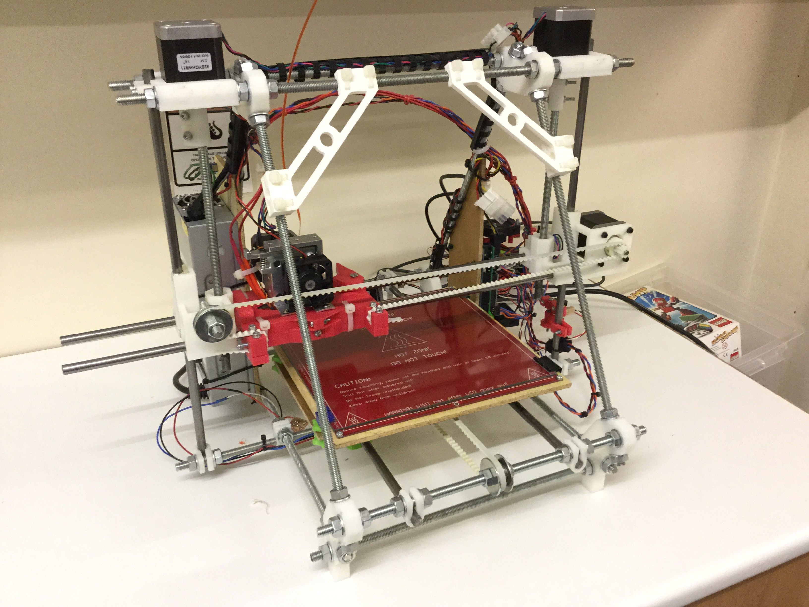

> This page is a work in progress and only contains some of the pieces needed to use the printer - please ensure you have been instructed on its proper use before operating the printer.

### 3D Model Files

Ready-made 3D models can be downloaded from sites such as [Thingiverse](http://www.thingiverse.com/thing:200472/#files), [YouMagine](https://www.youmagine.com), and [My Mini Factory](http://www.myminifactory.com). Part catalogue sites such as [GrabCAD](https://grabcad.com) and [STL Finder](http://www.stlfinder.com/) can also be useful for models of various standard parts. The `STL` file format is preferred (where available).

Create your own designs using software such as [FreeCAD](http://www.freecadweb.org/wiki/index.php?title=Download#Stable_FreeCAD_installers) or [OpenSCAD](http://www.openscad.org) ([[workshop info|OpenSCAD Training]]), then export the 3D model as an `STL` file.  Other software to work with and convert between various 3D and 2D formats are [MeshMixer](http://www.123dapp.com/meshmixer), [Blender](http://www.blender.org/download/), [SketchUp](http://www.sketchup.com/products/sketchup-make), and [Inkscape](https://inkscape.org/download/).

### Slicing

To print a 3D model, it must first be rendered as a 3D 'mesh' and exported as an `STL` file. The `STL` file is then 'sliced' into layers and exported as `gcode` toolpath instructions for the printer to follow.

If the model isn't available as an `STL` file, some formats - such as `STEP` - can be opened in [FreeCAD](http://www.freecadweb.org/wiki/index.php?title=Download#Stable_FreeCAD_installers) or similar software, and then exported as `STL`.  Most slicing programs also support `OBJ` files - this can be useful if an `STL` version isn't available, or if a design is to be exported from a program that only supports `OBJ` (e.g. [SketchUp](http://www.sketchup.com/products/sketchup-make)).

The slicing software needs to be configured for the printer and material used, as well as the type of output required (lightweight vs. strong, good quality vs. speed, etc.). Below are some profiles for various software packages that can be imported and used as a starting point with the Prusa Mendel 3D Printer we have at the Hackspace.

With a suitable profile the main parameters to optimise for quality are layer height and shell thickness/speed; while print speed and infill mostly affect the print time and strength.

 | [CraftWare](http://www.craftunique.com/craftware) | [Cura](https://www.ultimaker.com/pages/our-software) | [Slic3r](http://slic3r.org/download) | [Repetier](http://www.repetier.com)
:---------- | :------ | :-------- | :-------- | :--------
__[Prusa Mendel]__ | [PLA][CraftWare-PLA] | [PLA][Cura-PLA] | [PLA][Slic3r-PLA] | 
 | [Filaflex][CraftWare-Filaflex] | [Filaflex][Cura-Filaflex] | [Filaflex][Slic3r-Filaflex] | 
 |  |  | [Bundle][Slic3r-Bundle] | 

[Prusa Mendel]: https://github.com/snhack/Prusa-Mendel-Firmware
[CraftWare-PLA]: https://github.com/snhack/Prusa-Mendel-Firmware/blob/master/Profiles/CraftWare/PrusaMendel-PLA.cwsp
[CraftWare-Filaflex]: https://github.com/snhack/Prusa-Mendel-Firmware/blob/master/Profiles/CraftWare/PrusaMendel-Filaflex.cwsp
[Cura-PLA]: https://github.com/snhack/Prusa-Mendel-Firmware/blob/master/Profiles/Cura/PrusaMendel-PLA.ini
[Cura-Filaflex]: https://github.com/snhack/Prusa-Mendel-Firmware/blob/master/Profiles/Cura/PrusaMendel-Filaflex.ini
[Slic3r-Bundle]: https://github.com/snhack/Prusa-Mendel-Firmware/blob/master/Profiles/Slic3r/PrusaMendel.ini
[Slic3r-PLA]: https://github.com/snhack/Prusa-Mendel-Firmware/blob/master/Profiles/Slic3r/PrusaMendel-PLA.ini
[Slic3r-Filaflex]: https://github.com/snhack/Prusa-Mendel-Firmware/blob/master/Profiles/Slic3r/PrusaMendel-Filaflex.ini

<!--
Software | Profiles | | |
:---------- | :------ | :-------- | :--------
[CraftWare](http://www.craftunique.com/craftware) | [PLA.cwsp] | [Filaflex.cwsp]
[Cura](https://www.ultimaker.com/pages/our-software) | [PLA.ini] | [Filaflex.ini]
[Slic3r](http://slic3r.org/download) | [PLA.ini][Slic3r-PLA] | [Filaflex.ini][Slic3r-Ffex] | [Bundle][Slic3r]
[Repetier-Host](http://www.repetier.com)
-->

### Print Server

The printer has a dedicated Raspberry Pi that serves a web interface using [OctoPrint](http://octoprint.org). It can be accessed on the `MOCBTHUB` wifi network at <http://172.16.0.21:5000>.

> TO BE ADDED: Instructions on printer setup, and use of OctoPrint.

Upload either a prepared `gcode` file, or an `STL` file to be sliced by OctoPrint (using the CuraEngine and a preset configuration _note: not yet implemented)_.