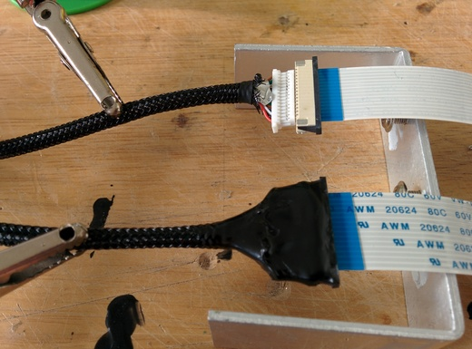
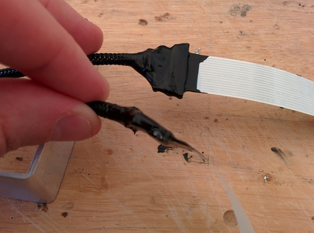

title:        Liquid Tape vs a Pi Camera Lead
subtitle:     An Alternative to Hot Glue or Heatshrink
categories:   projects
author:       Robert Longbottom
image:        liquidTapeBottle.jpg
date:         2014-11-11 17:08
discuss:      #leave until published

A while back I was watching either a YouTube video or reading a
blog post about soldering wires onto PCBs, possibly a quadcopter power
distribution board.  After soldering, the guy got out something called
liquid electrical tape and gobbed some over the solder joints to
reinforce them.  Brilliant I thought!  Why have I never head of this
stuff before?  I usually use the hot glue gun for things like that,
but somehow this looked better and neater.

<!-- more -->

So I promptly got on Google and looked into this stuff. There
were a few different manufacturers and it wasn't that
cheap, so I nearly didn't buy any because I didn't have a specific use
for it at the time.  But in the end I thought what the heck and
ordered some from [Amazon](http://www.amazon.co.uk/gp/product/B000LNKIFS).

It arrived, I opened it, looked at the bottle of black gooey tar-like
liquid, went "mmm, nice", didn't really have a use for it and so it
sat on my desk unused.  

Until now! 

## Enter the Round Raspberry Pi Camera Extension Cable.

I've been meaning to fit a camera to my 3D printer's Raspberry Pi and
[hook it into OctoPrint]()
since I got the printer, and I finally got round to getting a camera.  The 
cable  that comes with it however, is flat and woefully short.  Not great 
for routing around to get the camera into the ideal location.  I'd looked 
for round cables in the past with no joy, but was pleased to find that 
someone was now selling them on [eBay](http://stores.ebay.co.uk/picables).

As it arrives it's a bit "diy" to say the least, but that's okay. What
you get is a cable with a plug on each end and a socket that looks
like it should be mounted onto a PCB.
Plugging the plug part into the back of the PCB socket and connecting
up the camera proved that it worked fine, however the connection
wasn't at all secure and any movement of the camera or cable caused it
to stop working, requiring a reboot of the Pi to get it going again.

That wasn't going to be very good, since I was planning on mounting the
camera on my printbed which moves back and forth.  I thought about heat 
shrinking the connection to reinforce it, but
realised it was a perfect opportunity to try out the liquid 
tape that had been sitting on my desk for quite a few weeks now.

Knowing that the cable was working, I supported it on my desk with
some helping hands and a random heat sink that was lying around, then
started to apply the black goo from the bottle using the brush
attached to the inside of the lid.

I applied plenty so as to cover the whole of the PCB socket; all the
time hoping this worked, because it wasn't going to come apart again
without making some serious mess and probably ruining the cable.

It took a couple of coats to get a good covering (that's what it 
recommends on the bottle).  The goo seemed to shrink slightly as it 
dried and formed a nice tight rubbery seal around the connection.

The finished seal looks pretty tidy, probably more tidy than if I'd
used heat shrink. The cable still works and the camera can be moved
around without loosing its connection to the Raspberry Pi. Success!

So, if you enjoy messing around with black goo, enjoy the smell of strong 
solvent and have some electrical connections that need sealing or 
reinforcing, I can highly recommend using some liquid electrical tape.
