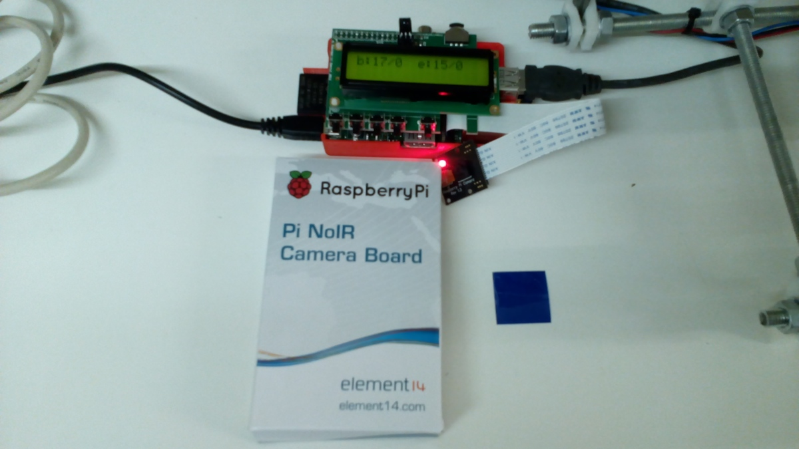
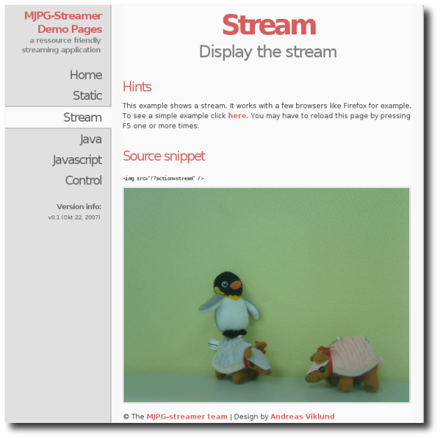
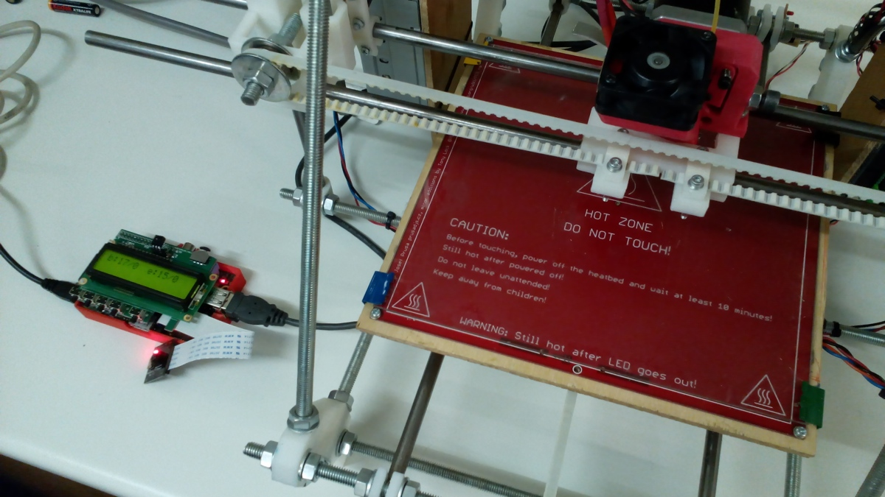

title:        Octoprint and the Raspberry Pi Camera Module
subtitle:     3D Printer Upgrade
categories:   projects
author:       Steve Wood, AKA Gyrobot
image:        10-sml.jpg
date:         2014-05-19 14:20
web:          http://www.gyrobot.co.uk

The Hackspace recently took delivery of a Raspberry Pi NoIR Camera Module from 
[Farnell](http://uk.farnell.com/) - full details are on [their website](http://uk.farnell.com/raspberry-pi/rpi-noir-camera-board/raspberry-pi-noir-camera-board/dp/2357308).
It is an add-on camera module for the Raspberry Pi which has no infrared filter, making it perfect for taking infrared photographs or photographing objects in low light (twilight) conditions. The camera plugs directly into the Pi by way of a 15 pin Ribbon Cable, to the dedicated 15 pin MIPI Camera Serial Interface (CSI). The standard ribbon cable supplied is going to be too short for our 3D printer needs, but longer ribbon cables can be purchased. The cable can easily be replaced by uncoupling at the camera end.

<!-- more -->

- General Specification
- Omnivision 5647 sensor in a fixed-focus module without IR filter
- 5 megapixel
- 2592×1944 stills
- 1080p at 30 frames per second
- 720p at 60 frames per second
- 640x480p at 60/90 frames per second
- CSi interface with 150mm ribbon cable
- Weighs 2.4g (3.4g with ribbon cable)

In this post I'll cover what we did to get the camera module working and ready for use. There will be a follow up post which will show how we are actually using it and how the camera and Pi is fitted to the printer.

##A Bit of Background

The Hackspace already has a Raspberry Pi running as a 3D print server allowing the controlling of our Prusa Mendel through the two options of either [Octoprint](http://octoprint.org/) or [Repetier Server](http://www.repetier.com/repetier-server-download/). The Pi distribution was provided by myself and is [Raspbian](http://www.raspbian.org/) with Octoprint and Repetier Server loaded afterwards. What we need to do is add support for the RaspiCam and web video streaming. Initially to take timelapse videos of 3D printing then moving onto other projects afterwards.

##Repetier Server or Octoprint?

The short answer for the Hackspace is both, and we use whatever our own personal preference is. Repetier Server is not to be confused with [Repetier Host](http://www.repetier.com/documentation/repetier-host/), which is by the same developer. Repetier Host is a full work flow solution for 3D printing to create, visualise and edit printer paths, as well as full printer control. All of this software is completely free.

Octoprint has built in camera support for time-lapse video or stills while printing, or even live streaming via it's web interface. It also allows graphical visualisation of the printer extrusion paths live as they are being printed. Repetier Server does not have support for either of these although live streaming can still be accessed on port 8080 via the [mjpg-streamer web interface](http://sourceforge.net/apps/mediawiki/mjpg-streamer/nfs/project/m/mj/mjpg-streamer/7/7f/Screenshot_static_example.png), which gets installed as part of the set-up for the video side of things (more on that later). Repetier server has an annoying bug where after you have ran a print job, the manual extrude feature either does not work, or wants to extrude forever, resulting in a switch off and switch on solution. However, Repetier server does seem faster when uploading gcode, or when choosing to print a previously uploaded file.

For the purposes of this article we will be focusing on using OctoPrint, because as mentioned earlier, it has built in camera support.

##The Beginning

To create a 3D print server on a Pi from scratch, the easiest route to follow is to download the [OctoPi](https://github.com/guysoft/OctoPi) distribution and follow their instructions, which have everything included to get the Pi working with OctoPrint and the RaspiCam. You can then add on Repetier Server to this afterwards should you wish. Installing OctoPi would make this article end now and everything would be so straight forward.

## Updating the Raspberry Pi

It's been sometime since the Pi was updated so we thought it was best to go through this first.

We updated the Raspbian install on our Raspberry Pi by running :

	apt-get update && apt-get upgrade

You may need to be root, in which case :

	sudo apt-get update && sudo apt-get upgrade

This took some hours.

## Enabling the camera

Open the `raspi-config` tool from the Terminal:

	sudo raspi-config

Select `camera`, then select `Enable`, and when prompted to reboot select `Yes`.

Updating your operating and enabling the camera using raspi-config did two things. It told your Pi that there is a camera attached and it added three command line utilities.

	raspistill
	raspivid
	raspiyuv

With the camera module connected and enabled, enter the following command in the Terminal to take a picture:

	raspistill -o cam.jpg

For more on command line usage, see : [http://www.raspberrypi.org/documentation/usage/camera/raspicam/README.md](http://www.raspberrypi.org/documentation/usage/camera/raspicam/README.md)

## Installing Octoprint

If you do not have Octoprint installed and don't fancy installing the [OctoPi](https://github.com/guysoft/OctoPi) distribution, then maybe you would prefer to add Octoprint onto your existing Pi OS? For this I would only be repeating (and not very well) what has already been written over on the [OctoPrint Github Repository](https://github.com/foosel/OctoPrint/wiki/Setup-on-a-Raspberry-Pi-running-Raspbian), so check it out.

## Adding RaspPiCam Support to Octoprint

The repository we need to download, unpack and compile is [mjpg-streamer-experimental](https://github.com/jacksonliam/mjpg-streamer) by Liam Jackson. This has the RaspiCam plugin

For the compile side, we need to ensure the command `cmake` and a dev version of `libjpeg` is pre-installed:

	sudo apt-get install libjpeg62-dev
	sudo apt-get install cmake

When prompted select `Y` to install.

	cd ~
	wget https://github.com/jacksonliam/mjpg-streamer/archive/master.zip
	unzip master.zip
	rm master.zip
	cd mjpg-streamer-master/mjpg-streamer-experimental
	make clean all

You can run dirctly from the mjpg-streamer-experimental folder with:

	export LD_LIBRARY_PATH=.
	./mjpg_streamer -o "output_http.so -w ./www" -i "input_raspicam.so"

You can also specify options, like in `raspivid` above

	export LD_LIBRARY_PATH=.
	./mjpg_streamer -o "output_http.so -w ./www" -i "input_raspicam.so -x 1280 -y 720 -fps 15 -ex night"

If you have followed the install guide for [OctoPrint](https://github.com/foosel/OctoPrint/wiki/Setup-on-a-Raspberry-Pi-running-Raspbian) correctly, then you will need to make the following changes to your [startup script](https://github.com/foosel/OctoPrint/wiki/Setup-on-a-Raspberry-Pi-running-Raspbian#automatic-start-up) to now look at this new mjpg-streamer-experimental folder:

Edit the `/home/pi/bin/octoprint` start up script with the following:

	#!/bin/sh
	OCTOPRINT_HOME=/home/pi/OctoPrint
	MJPEG_STREAMER_HOME=/home/pi/mjpg-streamer-master/mjpg-streamer-experimental
	export LD_LIBRARY_PATH=$MJPEG_STREAMER_HOME

	# start mjpeg streamer
	$MJPEG_STREAMER_HOME/mjpg_streamer -i "$MJPEG_STREAMER_HOME/input_raspicam.so -x 1280 -y 720 -fps 15 -ex night" -o "$MJPEG_STREAMER_HOME/output_http.so -w $MJPEG_STREAMER_HOME/www" &

	# start the webui
	$OCTOPRINT_HOME/run --daemon start

Hopefully that's it, after a reboot, you should find that OctoPrint is running on the `http://<your Raspi's IP>:<port number>` you have assigned and the webcam feed from the RaspiCam is visible in the `Control` tab

You can see in the following photo that the infrared from a remote control can be picked up, due to this model of RaspiCam having no infrared filter.

NOTE : You can still access the webcam stream without OctoPrint installed, in case you want to use Repetier Server instead. Just type `http://<your Raspi's IP>:8080` in your favourite browser.

## Next Steps

We now need to design an enclosure for the Pi and PiFace, buy a longer camera ribbon connection, then find a suitable mounting position on the Prusa Mendel for it's final resting place.

