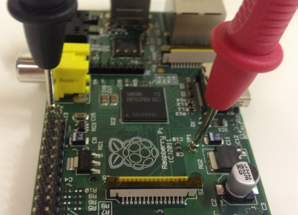

---

title: About the Hackspace
description: About the Swindon Hackspace
sharing: false
sidebar: false

---

[{:.right}](testpi-full.jpg)

The Swindon [Hackspace] formed in June 2012, holding [weekly meetings](#weekly-meetings)
for those interested in making, breaking, and fixing things. We are always looking to build membership and grow [our toolkit].

[Hackspace]: http://en.wikipedia.org/wiki/Hackerspace
[our toolkit]: {{ site.github_wiki }}/Tools-and-consumables
[projects]: {{ site.github_wiki }}/Hackspace-Projects

Members work on a range of [projects] that usually involve electronic hardware, software
programming, and mechanical assembly. Popular projects often include prototyping
electronic circuits using breadboard, and interfacing with [Arduino], [Raspberry Pi] or
[Stellaris LaunchPad] microcontrollers.

Members occasionally run informal sessions on topics such as [PICAXE], Laser Cutting,
[OpenSCAD], and 3D Printing. If you have an idea for a session you would like to run,
please let us know via the [group] or on twitter [@snhack].

[PICAXE]: http://www.picaxe.com
[OpenSCAD]: http://www.openscad.org

[Arduino]: http://www.arduino.cc
[Raspberry Pi]: http://www.raspberrypi.org
[Stellaris LaunchPad]: http://www.ti.com/ww/en/launchpad/stellaris_head.html

[group]: {{ site.rss_feed_title_url }}
[@snhack]: https://twitter.com/intent/tweet?screen_name={{site.twitter_user}}

### Weekly Meetings

The Swindon Hackspace meets weekly at the [Museum of Computing], located near the Wyvern
Theatre ([view map]) and next to the Regent Circus bus stops[^busstops] (northbound).

Sessions start at 6.30pm each Wednesday and run until 10pm-11pm. Visitors are strongly
encouraged to bring along works in progress, new and interesting hardware, or any other
projects or shiny gadgets. There is a doorbell to ring later in the evening when nobody
is on the reception desk.

Session price is £4 and paid on admission. Membership is paid annually in advance
and costs £10 (waived until third visit for new members, due each July thereafter).

Limited free parking can normally be found on [Euclid Street], while the [Wyvern Car Park]
costs £1.00 for upto two hours, or £2 all night (both after 6pm).

Internet access is available via WiFi and Ethernet, we also have computers available if
required.

[^busstops]:
    Route numbers for nearby bus stops are shown on [this map][view map] (zoom
    in to see all three). Most local routes either pass through here, or within
    a 5 minute walk.

[Museum of Computing]: http://museumofcomputing.org.uk
[view map]: http://maps.google.co.uk/?q=The+Museum+Of+Computing+Swindon
[Euclid Street]: http://maps.google.co.uk/?q=Euclid+Street+Swindon
[Wyvern Car Park]: http://maps.google.co.uk/?q=Wyvern+Car+Park+Swindon

### Online Presence

The hackspace is active on [Google Groups], [Twitter], [Facebook], [YouTube], and [Github].

Related articles are published at <{{ site.url }}> (submissions [welcome]!).

[Google Groups]: {{ site.rss_feed_title_url }}
[Twitter]: http://twitter.com/{{site.twitter_user}}
[Facebook]: https://facebook.com/{{site.facebook_user}}
[YouTube]: http://www.youtube.com/user/{{ site.youtube }}
[Github]: http://github.com/{{site.github_user}}

[welcome]: https://github.com/snhack/snhack.github.com/blob/source/source/README.md
