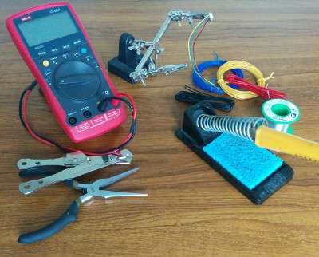

---

title: Facilities at the Hackspace
description: Facilities at the Swindon Hackspace
sharing: false
sidebar: false

---

[![The Hackspace]{:.pano}][Flickr]

[The Hackspace]: https://farm6.staticflickr.com/5513/11355438236_5ea3c62140_b_d.jpg
[Flickr]: https://www.flickr.com/photos/95440001@N04/11355438236/in/pool-swindon-hackspace/

The Hackspace itself is located at the [Museum of Computing]([view map]), and shares it's
location with the classroom that's used for computing courses such as [BBC First Click],
the [Children's Computer Club], and various other endeavours. Therefore, as well as a
general workbench area, we also have a dedicated computing space.

[Museum of Computing]: http://museumofcomputing.org.uk
[BBC First Click]: http://www.bbc.co.uk/webwise/guides/learning-resources
[Children's Computer Club]: http://museumofcomputing.org.uk/component/content/article/32-education-learning/91-ccc

Access is down stairs from the museum floor[^stairs]. We have WiFi Internet access and
computers available to use, but please bring your own laptop if you have one. Tea and
coffee making facilities are provided (as well as the tea and coffee).

The Hackspace is near the town centre, located next to the northbound Regent Circus bus
stops[^busstops]. Limited free parking can be found on Euclid Street after 6pm, or in the
Wyvern Car Park for £1.00.

[^stairs]:
    Unfortunately, there's no wheelchair access to the hackspace; though it is
    still possible to visit the museum space upstairs. If you'd like to attend a
    particular event or class, please let us know in advance and we'll try to sort
    something out.

[^busstops]:
    Route numbers for nearby bus stops are shown on [this map][view map].
    Most local routes either pass through here, or within a 5 minute walk.

[view map]: http://maps.google.co.uk/?q=The+Museum+Of+Computing&cid=1649343045243643722

## The Equipment

[{:.right}][tools page]

<!-- Restrict width of list items -->

Here is a summary of tools and equipment the Hackspace has available for
members to use.  For a full list please see the [tools page] on our [wiki].

[wiki]: {{ site.github_wiki }}/
[tools page]: {{ site.github_wiki }}/Tools-and-consumables
[projects]: {{ site.github_wiki }}/Hackspace-Projects
[3D printer]: {{ site.github_wiki }}/Prusa-Mendel-3D-Printer

- Prusa Mendel [3D printer] - we can offer design advice, assistance, and
  help with running the printer.

- General workshop tools, hobby lathe, soldering irons, hot glue gun. Oscilloscopes,
  multimeters, test equipment. Various electronics equipment and components. Breadboards,
  jumper leads, etc.

- [Raspberry Pi], RPi [Camera Board], and [PiFace] Control and Display Board.
  [Stellaris Launchpad], [PICAXE]<!-- , and [Arduino] -->. We are happy to help you
  learn about interfacing electronic components with embedded processors.

- Miscellaneous new and old items to experiment with.

[PiFace]: http://snhack.dev/blog/piface-control-and-display-board/
[Camera Board]: http://snhack.dev/blog/octoprint-and-the-raspberry-pi-camera/
[Raspberry Pi]: http://www.raspberrypi.org
[Stellaris LaunchPad]: http://www.ti.com/ww/en/launchpad/stellaris_head.html
[Arduino]: http://www.arduino.cc
[PICAXE]: http://www.picaxe.com

### In Development

- PCB making facilities - we have a UV light box and a [pen plotter] being
  modded to plot using an etch resist pen.

- [3D printer] - we are always doing upgrades to the printer, trying to
  improve the print quality, but do manage to get some priting time in-between.

[pen plotter]: {{ site.github_wiki }}/Pen-plotter